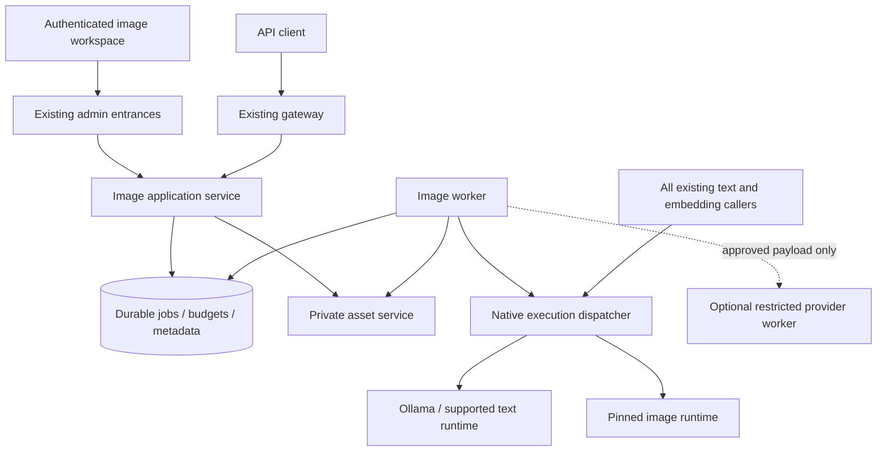

# Image Generation Architecture and Contracts

**Proposed, not implemented.** Requirements and evidence are in the
[plan](../image-generation.md) and [baseline](./verified-baseline.md).
Names below are proposed contracts, not existing endpoints or database tables.

## 1. Boundaries

The image application service is a bounded use-case layer; the diagram does not
require every box to become a microservice. Use a separate worker process for
durable execution. The native dispatcher must be a separate supervised host
process because it arbitrates the physical runtime boundary. Asset storage needs
a private service boundary so the public gateway does not mount all tenants'
files. Final process packaging belongs to delivery slice P1/P3, with the trust
and credential matrix reviewed before enabling either path.

Keep the gateway and admin network/identity separation. No image service may
proxy arbitrary requests into an admin entrance, accept shell commands, expose a
Docker socket, or let a job choose an upstream URL. Share domain use cases without
sharing the admin credential with a gateway or a GPU process.

### Runtime and registry

Introduce an ImageGenerationPort with explicit submit/run, observe, cancel and
result semantics. Adapters must declare whether execution is synchronous or
upstream-job-based, whether cancellation is confirmed, and whether progress or
partial previews are real. Unsupported operations raise a typed capability error.
Do not make images look like CompletionChunk text or add dummy embed methods to
an image-only adapter.

Retain one model registry identity and route capabilities through structured
policies. Introduce concrete runtime endpoint identity (node, runtime, endpoint
configuration) rather than another global base URL keyed only by RuntimeKind.
For the initial release, exactly one configured local node is supported; reject
unimplemented remote targets. No need to implement general multi-node scheduling
to time-share this one node.

Use discriminated resource profiles: text retains context length; images record
approved size/batch/step/precision limits, warm residency and measured execution
peak. A workflow profile pins model digests, runtime version, nodes/operators,
sampler/settings and allowed parameters. A seed is useful provenance, not a
cross-version or cross-device determinism guarantee.

Separate three questions: implemented by this build, configured for this tenant,
and available now. A paused capability remains discoverable as supported;
generation is not advertised on a deployment lacking its implementation/profile.
Preserve the standard /v1/models shape; expose detailed modality, limits and
temporary availability through documented Nexus metadata/admin endpoints.

## 2. Shared-host execution ownership

### 2.1 Non-negotiable invariant

**No conflicting text load, embedding, summarization or generation may enter the
runtime after the node begins draining for an image window. No text work may
resume until image execution and memory release have been verified.**

A process-local semaphore, a UI banner, a routing-policy edit, or an expiring
Redis lock alone cannot enforce this. A lost lease does not stop a GPU kernel.

Proposed enforcement has two layers:

1. PostgreSQL stores node mode, mode version/epoch, scheduling owner lease,
   transition checkpoint, restore manifest and active logical operations.
   Atomic admission checks mode and registers work in a short transaction.
2. A native dispatcher is the sole supported caller of the managed runtimes.
   It validates the current execution epoch, owns active dispatch handles, and
   serializes transitions with new runtime calls. Stale owners cannot dispatch
   new work after takeover. A replacement must reconcile actual execution before
   declaring a node free.

The dispatcher exposes separate fixed inference and lifecycle verbs with separate
credentials. The gateway's inference identity cannot change mode, install models,
or unload other work. Management requests require operator authorization; the
worker only executes validated jobs. Runtime ports stay loopback/private and are
removed from ordinary application reach where feasible. Document and test the
host/firewall boundary: localhost alone does not isolate one local process from
another. Local root/operator access remains trusted and out-of-band changes are
detected as drift, not claimed to be impossible.

The dispatcher is not a generic HTTP proxy. Request size, model reference,
registered endpoint, execution mode and operation ID are validated. Stream bytes
through with bounded buffers and preserve cancellation/backpressure. GPU
libraries remain in the runtime service, outside gateway/admin images.

This is deliberately more work than adding a shared lock to each router.
Alternative A (UI/policy pause only) misses background and auto-load paths.
Alternative B (a database lease checked by every application) closes normal
admission races but cannot fence a delayed former owner at the runtime boundary.
The proposed dispatcher closes that gap at the cost of another supervised
component and a text-path migration. If P1 chooses a simpler alternative, it must
show equivalent crash/lease behavior or explicitly restrict the release to manual
fully drained windows with no automatic failover; it cannot claim the same safety
properties merely because only one machine exists.

Admission and mode checkpoint writes fail closed. Do not reuse the existing
ModelStateCommitter contract that logs/suppresses failed commits. An execution
claim that was not persisted must never grant permission to touch the runtime.

All app replicas and entrances use the same admission authority. Nested work
uses an operation-scoped permit rather than reacquiring the exclusive resource:
RAG embedding -> chat and chat -> Tier 2 assist must not deadlock. A request
admitted before draining may finish its bounded child calls; it cannot add
unbounded new children. Drain waits on the logical operation, not just the
currently active upstream socket. Old permit replay is rejected after completion.

Ingestion takes admission for bounded batches and checkpoints before pausing
between batches. A mode change must not make a partially indexed document READY.
Downloads may be deferred because disk, page cache and model stores also consume
the host's margin. Manual load/unload, runtime evaluation tools and automatic
warm-up must respect the same boundary; no direct-call backdoor in normal tools.

### 2.2 Mode state machine

| Mode | Admission and required evidence |
|---|---|
| TEXT_READY | Admit configured text operations; image jobs may queue but do not dispatch |
| DRAINING_TEXT | Atomically stop new affected operations, persist restore manifest, let already-admitted work finish |
| RELEASING_TEXT | Dispatcher unloads the conflicting resident set; fresh residency and host memory evidence required |
| IMAGE_READY / IMAGE_RUNNING | Admit only jobs within the approved image profile/window; one image execution at a time initially |
| RELEASING_IMAGE | Stop dispatch, finish/cancel current image as policy allows, verify runtime idle and memory released |
| RESTORING_TEXT | Restore the manifest in validated order and context settings; check service readiness |
| RECOVERING / DEGRADED | Block conflicting dispatch until actual runtime state is known; keep management and asset reads available |

These are workload availability modes, not replacements for NodeStatus. A
healthy node can intentionally pause a capability. Heartbeat reports observations
without overriding the controller's mode or racing a lifecycle transition.

Persist the pre-switch desired service profile and a fresh observed resident set,
including refs, contexts and revisions. Restore the agreed profile, not every
model marked LOADED in stale rows and not every historical model. Validate it
against current settings before switching. Serialize edits to affected model/node
profiles while a transition owns them; refuse with a clear conflict instead of
restoring obsolete settings.

The September 7 large-model-first ordering is a candidate for the current text
profile, not a universal rule. Rehearse a full cold load and dependent service
readiness on the actual machine. Do not count an early-return Load response as a
load test, or /api/ps memory as a sufficient measure of peak working memory.

### 2.3 Pause policy and fairness

The first release uses operator-scheduled windows. Users cannot force an immediate
mode change merely by submitting a job. The window has a maximum drain wait,
maximum image execution duration, maximum batch/window budget and a text-service
restoration deadline. Choose values from measurements before enabling it.

Default proposal: drain active text without forced cancellation. If the drain
deadline expires, abort the switch and return to text admission; image jobs remain
queued with a visible reason or expire under their own queue TTL. Do not loop
forever draining, and do not reset a window deadline for each new image job.

While paused, new synchronous affected inference returns `503 capability_paused`
with request ID and a truthful Retry-After when an estimate exists. It is not
quota exhaustion or no_available_model. Polling, cancel, asset delivery, login,
settings, audit and status remain available. The existing long invisible chat
queue is not the image scheduler. UI status names affected capabilities and the
expected window, without exposing another user's prompts or identity.

Initially assume all local GPU inference pauses. Keeping a small assistant or
embedder resident is allowed only after measuring its concurrent peak with the
image workload. The user's acceptance of partial suspension does not require
preserving an unmeasured co-resident model. Management itself remains usable.

If the process/host restarts, enter RECOVERING, reconcile active operations and
runtime state, then restore the pre-switch profile if a transition was active.
Never blindly warm all text weights while image execution may still exist.
An expired owner lease blocks new work; it is not evidence that old work stopped.
If the dispatcher cannot confirm upstream cancellation, quarantine the resource
until completion or an operator-approved runtime restart. Never use a global
interrupt against a job not exclusively owned by the dispatcher.

## 3. Durable jobs and financial correctness

### 3.1 Proposed records

| Record | Essential fields and invariants |
|---|---|
| Image job | id, tenant, owner, submitting key, immutable request payload reference/hash, capability, profile revision, state, timestamps, deadline, cancellation request, request ID, idempotency scope |
| Execution attempt | job, attempt ID, node/provider, execution epoch, upstream ID, dispatch stage, started/finished times, safe error, retry classification |
| Image asset | tenant, owner, job/attempt, private storage key, media type, dimensions, size, checksum, provenance, validation state, retention/deletion state |
| Budget reservation/ledger | tenant/account, job, amount/unit/currency, reserved/settled/released, actual usage and cost, immutable uniqueness keys |
| Node execution state | mode, epoch, owner lease, bounded transition deadlines, active-operation references, restore manifest and revision |
| External approval (later) | approver, tenant, payload digest, provider/model/region, scope, expiry, revocation and policy revision |

Keep prompts separate from generally readable metadata. Reproducibility content
is a product asset with explicit retention, not a debug transcript workaround.
Do not overload UsageRecord.tokens with credits or redefine historical rows.

### 3.2 Lifecycle

`queued -> running -> validating -> succeeded`, with `failed`, `cancel_requested`
and `cancelled`, and a nonterminal `reconciling` state for uncertain dispatch.
Queue expiration is distinct from generation timeout. Generation success requires
validated, persisted output; a provider 200 alone is insufficient.

Create the job, quota reservation and initial event in one database transaction.
Poll durable eligible rows with atomic claim/lease semantics (for example,
SKIP LOCKED) and short transactions. PostgreSQL is the initial queue; Redis is
optional notification/progress acceleration. There is no database/Redis dual-write
gap in acceptance. If a message broker is introduced later, require an outbox.

Use at-least-once recovery with deduplicated transitions; do not promise universal
exactly-once generation. Record an attempt before external dispatch, persist its
upstream handle promptly, and identify the crash window where acceptance is
unknown. A provider lacking an idempotent submission or lookup cannot be retried
automatically in that window. Route to reconciliation/operator review instead.

Idempotency keys are scoped to tenant, principal and operation, with a canonical
request hash. Same key/same payload returns the same authorized job/result;
same key/different payload returns 409. Revocation and ownership checks still run
on replays. Retain deduplication tombstones for the documented retry window even
if image content is deleted, without retaining the prompt forever.

Reserve image credits or worst-case bounded cost atomically per tenant and per
caller before acceptance. Human/session requests are not exempt. Settlement is
unique per job/attempt ledger identity; duplicate callbacks cannot double-charge.
An incomplete/unknown provider usage report is unknown, not zero. Meter attempts
even when product policy refunds a failed result. Track storage separately.

Use separate limits for job creation, polling, downloads, queued jobs, active
jobs, image dimensions, output bytes, tenant storage and external spend. A spent
generation budget must not prevent reading or cancelling existing jobs.

Retry transport failures only when safe under dispatch state and deadline, with
bounded backoff and jitter. Never automatically retry a safety refusal, change
the model/quality to get around a failure, or send internal content externally.
After successful upstream generation, retry result retrieval/storage rather than
generation. If temporary output expires, report result loss and reconcile cost.

Cancel queued work atomically and release reservations. Running cancellation is
best-effort until confirmed; cancellation cannot undo provider spend. Resolve the
completion/cancellation race with one terminal transition. Release compute only
after actual execution ends. For n > 1 later, define per-image outcomes and partial
billing before exposing that parameter; first release accepts n = 1 only.

## 4. API contracts

| Proposed route | Contract |
|---|---|
| POST /v1/image-jobs | Nexus extension; 202 only after durable acceptance; job ID and Location |
| GET /v1/image-jobs/{id} | Authorized status, phase, output asset IDs, safe errors; no provider secret or internal path |
| POST /v1/image-jobs/{id}/cancel | Idempotent cancellation request, not a promise that upstream has stopped |
| GET /v1/image-jobs/{id}/events | Optional SSE metadata after polling works; authorized reconnect, sequence IDs and snapshot recovery |
| GET /v1/image-assets/{id}/content | Authenticated binary delivery with validated media type |
| POST /v1/images/generations | OpenAI-compatible synchronous facade over the same durable job engine |
| /admin/image-jobs and /admin/image-assets | Session/tailnet equivalents plus authorized private-library listing/deletion |
| POST /v1/images/edits | Deferred until image input/masks and edit semantics are verified |

For the compatibility endpoint use `model: image_generation`, following Nexus's
capability convention. Validate `prompt`, `n`, `size`, `quality`, output format
and response format against the selected advertised contract. Expose only a
documented subset; unsupported meaningful fields fail explicitly, with the
parameter named. Keep native-only seed/steps/workflow controls in the Nexus API
or a documented extension rather than claiming universal OpenAI compatibility.

Return the expected `created` and `data[].b64_json` shape for the initial base64
contract. Do not return a 202 job body where an Images SDK expects image data.
Define supported URL responses separately; a protected URL may be unusable to
clients that do not forward Authorization. Do not silently return an insecure URL
just to make such a client work.

The facade waits only within an explicit HTTP wait budget. If a result is not
ready, return a documented timeout/error with a job correlation header and safe
recovery instructions. Where proxies discard headers, an explicit idempotency key
still allows safe retry. Test the chosen SDKs' retries and timeout behavior.
Durable acceptance survives client disconnect; disconnect cancels observation,
not the job. This intentional difference from chat must be documented.

On a shared-host paused window, the public synchronous facade should reject
unserviceable immediate requests promptly rather than occupy a connection for the
existing 1200-second semaphore wait. Explicit asynchronous clients may queue.

Restrict default_capability substitution to the endpoint's modality family and
require the final capability to be held by the key. A default of chat cannot turn
an Images request into a text completion. Keep /v1/models discovery, key forms,
policy validation and the frontend capability schema consistent.

Use 401/403 for identity/permission, non-disclosing 404 for inaccessible resources,
409 for state/idempotency conflict, 413 for body size, 429 for rate/quota and
503 for scheduled pause/unavailable execution. Map other failures into the
existing safe error envelope and request-ID conventions. Before SSE begins, use
HTTP errors; after it begins, emit typed failure/terminal events. Revalidate long
subscriptions so key revocation/session expiry does not grant indefinite access.

## 5. Asset storage, delivery, and privacy

Use a private asset volume for the initial single storage owner. Store metadata
in PostgreSQL and binaries under platform-generated tenant/asset keys. Return no
caller-supplied filesystem path. A remote worker can upload to the same asset
service later; object storage becomes appropriate when scale/availability needs
justify it, not merely because binaries exist.

Write to a staging key, validate format/signature, dimensions, decoded pixel and
byte limits, then atomically publish the immutable asset and terminal metadata.
Database and filesystem cannot commit atomically: reconcile staged/orphaned
objects and missing-file rows after crashes. Garbage collection must respect
active readers/jobs and keep tombstones; deletion must win over late callbacks.

PNG/JPEG/WebP are candidates; choose the actual allowlist with the decoder build.
Reject SVG/HTML and decompression bombs. Isolate image decoding and thumbnail
creation with CPU/memory/time limits, no model credentials and no arbitrary
network access. Do not extend the knowledge document parser into a generic media
runtime. Strip unwanted EXIF/workflow metadata; preserve any required provenance
in an approved form. Treat upstream-generated binaries as untrusted too.

The browser uses same-origin authenticated asset routes so its existing entrance
identity works. Preserve CSRF on mutations, `nosniff`, content disposition and
private/no-store cache policy. Do not route private originals through an image
optimizer or CDN cache that drops authorization or shares cache keys. Use bounded
streaming delivery rather than loading whole galleries/base64 into app memory.

Default asset visibility is owner-private inside the tenant. Tenant administrators
and operators may see scheduling metadata needed for operations, not automatically
everyone's prompts/images. Future sharing is an explicit ACL grant. Every asset
reuse, thumbnail, event, download and delete follows the same ownership check.
Cross-tenant IDs return the same absence response as nonexistent IDs.

Short-lived signed links are optional future bearer capabilities: avoid logging
their query strings, set narrow lifetimes, explain revocation limits, and never
use them as permanent history identifiers. API keys do not belong in query strings.

Add retention for private prompts, originals, thumbnails, jobs and approval
payloads independently from audit/usage. Keep provenance/ledger handles after
content deletion without copying content into long-lived audit detail. Define
backup inclusion, encryption, expiration and restore-time deletion enforcement
together; current documents.tar backup does not include image assets. A restore
must reconcile DB and files and must not resurrect expired content as visible.

## 6. Security and external providers

Add explicit image use/read-own/delete-own and scheduler-operation permissions.
Map keys to image use only through issuable capabilities; never grant management
rights through a stored capability name. Regenerate role/audit catalogs. Actual
human-role grants remain a reviewed product decision, including external approval.

Review all new table grants before migration. Private job payloads and assets must
not inherit gateway SELECT ON ALL TABLES. Prefer narrowly scoped repository/API
operations and a dedicated image worker role; no schema-owner/admin DML credential
in a GPU runtime. Decide RLS or restricted database interfaces for new sensitive
tables in P3 and test the gateway role's effective privileges. Actor filters
protect ordinary application access; do not describe them as containing a fully
compromised trusted service. Narrow credentials and network access bound that risk.

Protect fixed image profiles against runtime supply-chain execution: pinned code,
approved model artifacts/digests, reviewed serialization formats, no runtime
package install from a prompt, no user-defined custom nodes, no unrestricted
workflow JSON and no arbitrary remote model URL. A safe weights format does not
make custom Python nodes safe. Model acquisition is an operator-controlled path
separate from inference egress.

Safety controls include bounded input/output inspection and a documented local
policy suitable for teaching materials. Pin and evaluate any moderation model;
its memory and execution also count in the node schedule. If the required check
cannot run, withhold the output with a visible failure/quarantine status. Partial
previews may not bypass the release policy. Evaluate false refusals as well as
misses, and never treat a policy gate as proof that an image is factually correct.

External providers are off by default and a later slice. A dedicated restricted
provider worker uses approved destinations and file-mounted credentials. Validate
provider polling/download URLs and redirects as well as initial endpoints; never
forward the provider API key to an output CDN. Reject local/private/metadata
destinations and DNS rebinding, and bound result bytes/time. No user webhook URLs
in the initial release; if callbacks are later used, verify signatures, replay,
event ordering and deduplication.

Before dispatch, check current tenant policy, credential activity, approval
expiry/revocation, exact final payload digest and provider/model/region. Changes
to prompt enhancement, references or a retry's provider invalidate the approval
unless expressly covered. Store who approved what without putting the content
into the audit log. Do not silently attach RAG passages or conversation history.

Provider retention/training terms, regional processing, license and cost must be
reviewed against the specific selected service before enablement. Internal-by-
default is an application policy, not a claim the existing Docker network denies
every Internet connection. No internal failure triggers external fallback.

## 7. Vision and Responses integration

Vision input, text-to-image, and editing are different operations. They may share
asset ingestion and validation; text-to-image does not depend on vision being
finished. The existing resident model might support input images, but its actual
artifact/runtime and extra working memory require testing.

When vision lands, represent ordered image/text parts in domain messages. Count
visual input separately from the existing GGUF text estimate, reserve its memory,
bound resolution and reject unsupported image sources. The initial input path
should accept authenticated platform assets or bounded upload/base64, not fetch
arbitrary caller URLs. Do not increase the global 4 MiB gateway body cap without
addressing pre-authentication allocation; use route-specific bounded upload handling.

Compaction must preserve essential image references and tool/result associations.
A generated asset used in a conversation is authorized again on every request.
Asset expiry is an explicit error, not permission to answer from text alone.

For now explicitly refuse the Responses image_generation tool wherever it can be
declared, rather than merely adding it to X-Dropped-Tools. Later implement a
bounded image tool orchestrator with correct image_generation_call output/events,
authorization for both chat and generation, separate usage, and at most the
configured number of tool calls. Release the text execution permit while the
image job waits and account for mode transitions between steps.

The existing Responses facade is stateless and ignores extra fields. Do not
claim background mode, stored responses, previous_response_id, image replay or
partial-image streaming until their state, authorization and compatibility tests
exist. New unsupported stateful parameters must not silently succeed. Keep native
job progress events separate from OpenAI image events until the mapping is tested.

## 8. Frontend and operational visibility

Add an image workspace using existing API client, query hooks, error presentation
and navigation conventions. Keep API keys out of the browser. Show the user:

1. Prompt, examples relevant to teaching, ratio and limited quality presets.
2. Internal processing by default, retention notice, quota estimate and window
   availability; external submission only after the approval flow exists.
3. Queued/draining/loading/generating/validating/storing phases. Percentage/ETA is
   optional and never fabricated; node-step progress is not whole-job percentage.
4. Preview, download, regenerate and delete. Regenerate creates a new job and
   charge; network retry reuses the original idempotency key.
5. Private history restored after refresh. Navigation stops polling/SSE but does
   not cancel a durable job. Explicit Cancel shows requested versus confirmed.

Provide keyboard/mobile operation, accessible status announcements and bounded
thumbnail lists. Query caches must clear on logout/account changes; do not store
prompt/image payloads in localStorage or analytics. Ratio presets map to validated
model sizes. Prefer editable slide labels outside the bitmap when text accuracy
matters; test Traditional Chinese rendering before advertising it as reliable.

Add mode/availability indicators to chat, assistant, knowledge and model lifecycle
screens so a deliberate pause is actionable. Disable irrelevant mutation buttons
with explanations. Existing settings/health/asset reads must remain usable even
while the assistant is unavailable. API-reference pages and generated schemas
must describe the deployed subset and job continuation semantics.

Metrics: mode dwell and restore time, queue wait/depth/oldest age, execution and
validation duration, active operations, image count, failures/cancellations,
uncertain attempts, reservation age, storage bytes, orphan count and restoration
failures. Use bounded labels (runtime/profile class/error), not prompts, job IDs,
API keys or tenants in Prometheus. Tenant breakdown belongs in scoped DB reports.
Separate expected scheduled pause from unexpected failure, and alert on an
overdue window or recovery failure rather than suppressing all health alerts.

## 9. External references checked during planning

These describe upstream interfaces, not installed Nexus support or measured
performance. Recheck exact pinned versions during P0/P4.

- [OpenAI image generation](https://developers.openai.com/api/docs/guides/image-generation):
  Images and Responses are distinct entry points; base64 results and image tool
  events require their own translation. Image APIs can report image tokens.
- [Ollama vision](https://docs.ollama.com/capabilities/vision): REST messages accept
  an images array containing base64 data. This does not validate the deployed model.
- [ComfyUI routes](https://docs.comfy.org/development/comfyui-server/comms_routes):
  prompt queue, history, WebSocket progress and image retrieval are available;
  interrupt targets current execution and needs ownership protection.
- [Diffusers MPS](https://huggingface.co/docs/diffusers/main/optimization/mps):
  Apple Silicon execution exists; memory pressure is a performance concern.
- [BFL generation](https://docs.bfl.ai/quick_start/generating_images): asynchronous
  polling and temporary output URLs require result ingestion rather than permanent
  hotlinking.
